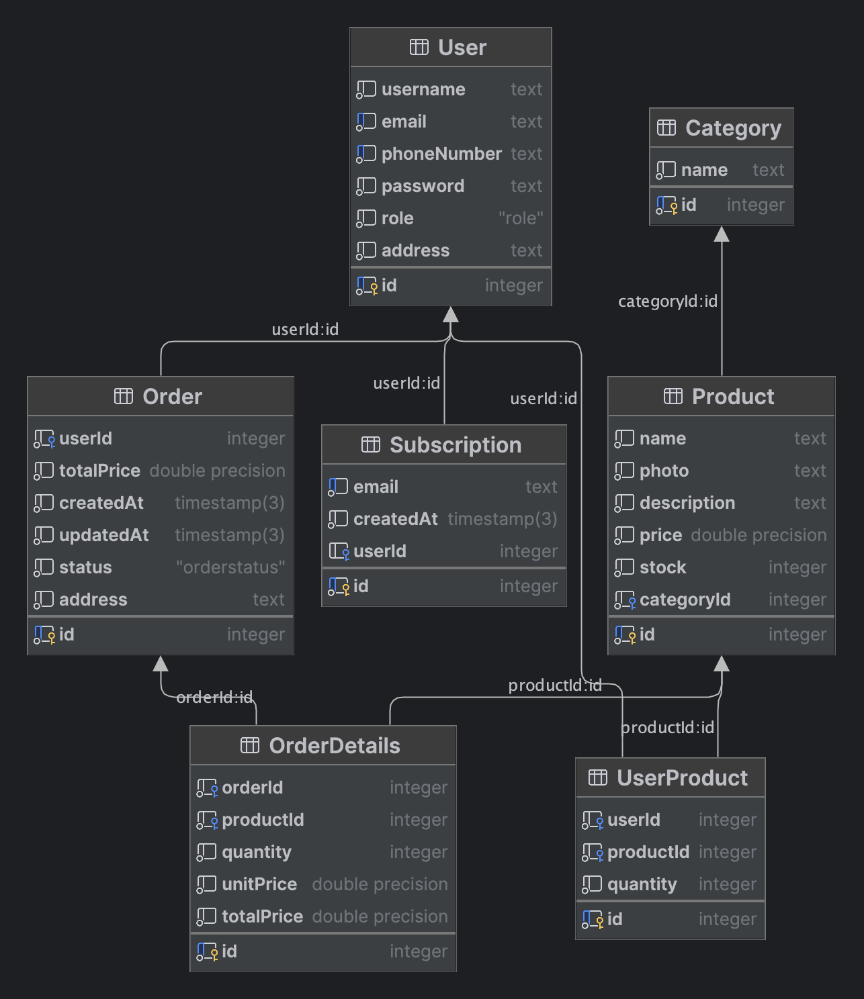

# dna-online-shop
### Сайт концепт-магазина для покупки одежды/аксессуаров
### Курепин Даниил Денисович M33031


### Описание сущностей из модели данных:
* ```User``` - сущность, характеризующая пользвателя с атрибутами: имя пользователя, почта, номер телефона, пароль, адрес, уникальный id
* ```Category``` - сущность, характеризующая категорию продукта, артибуты: название категории, уникальный id.
* ```Product``` - сущность, характеризующая продукт (какую-то вещь в моем случае) с атрибутами: название, ссылка на фото, описание, цена (float), наличие на складе (количество), к какой категории относится (ссылается на categoryId у ```Category```)
* ```Order``` - сущность, характеризующая заказ юзера, атрибуты: уникальный id, id пользователя, общая стоимость заказа, дата создания, дата когда последний раз обновлялся, статус (enum), адрес.
* ```OrderDetails``` - сущность, характеризующая детали заказа юзера по конкретному продукту. Атрибуты: уникальный id, id заказа, id продукта, количество продукта, цена за штуку, общая стоимость (количество * цена за шт.), дата создания и дата обновления.
* ```Subscription``` - сущность, характеризующая подписку на рассылку. Атрибуты: уникальный id, почта уникальная, дата создания и дата обновления, id юзера (если юзер с такой почтой есть).

